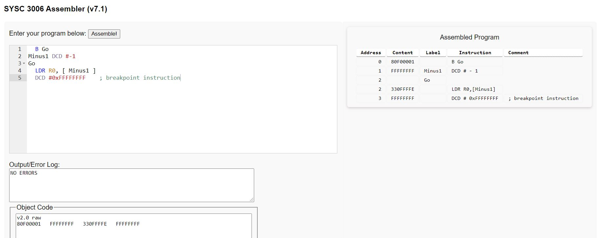
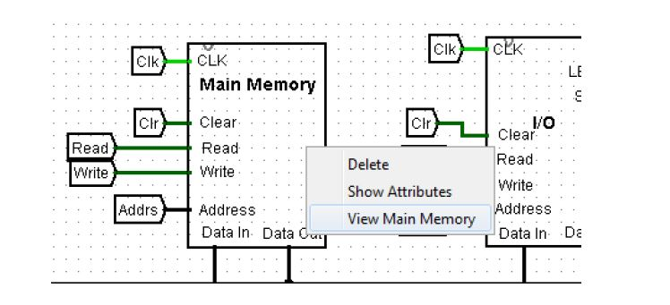
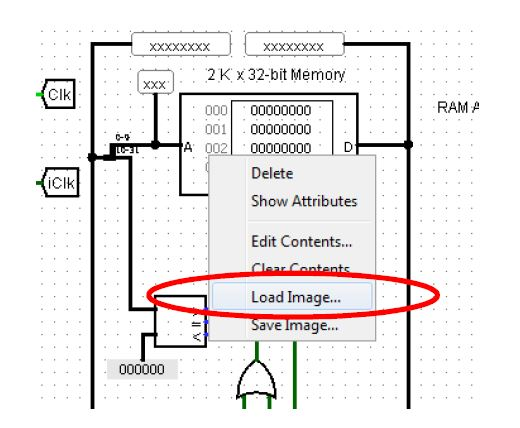
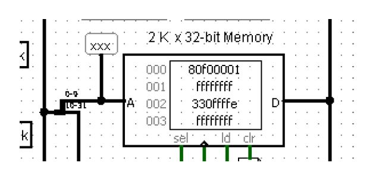
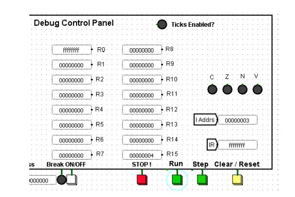
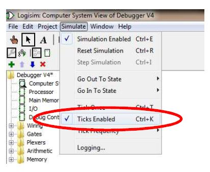

# Assembly Projects

by Bardia Parmoun

Released on: 15/03/2021

## DESCRIPTION
- This repository is a collection of some of the assembly projects that I have worked on 
- These projects deal with arrays and perform basic operations on an array

## RUNNING THE PROGRAM
- In each folder there are 3 files
1. The source file with the name SRC contains the raw code for the program written in ARM assembly.
2. The object file with the name OBJ is the assembled version of the code that can be used for debugging.
3. The output with the name OUT is the expected output of the program

- To be able to use the debugger you need to use the simulation program of logisim which can be downloaded from the following link: 
```http://www.cburch.com/logisim/```
 
## USING THE PROGRAM
1. The code for the program first needs to be assembled. Locate the Assembler in the assembler folder. After opening it copy past the code and click on assemble.

    The assembled version of the code can be found on the window below the code. Copy that into a txt file.

<p align="center">

</p>

2. After the object code was obtained input that into the debugger. To do this open the debugger in the debugger folder. Open its main memory component and load the object code.

<p align="center">
Locating the main memory

</p>
Loading the object code
<p align="center">
Loading the object code

</p>
<p align="center">
The code loaded in the memory

</p>

3. Then go back to the main debugger interface. Click on reset to load the first instruction. Then click on run to run the code
<p align="center">

</p>

## POSSIBLE ERRORS
- while running the debugger make sure that in logisim simulation and ticks are enabled. You can change the ticking frequency there for faster results
<p align="center">

</p>

- In addition make sure that the Debugger Support file and Debugger are always in the same folder to assure a smooth run for the debugger. 

## CREDITS
Author: Bardia Parmoun

Copyright © 2021 Bardia Parmoun. All rights reserved
